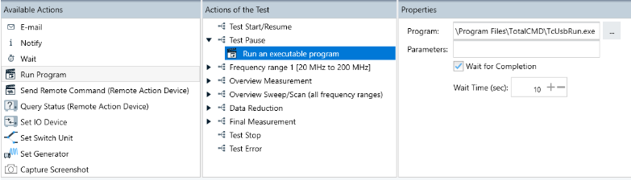

### Implementing Amplifier Remote Connection into ELEKTRA Testing Software

Work based on: https://github.com/joshur19/gpib_experiment

The idea is to implement the proposed solution to communicate with an amplifier system into the existing setup that is controlled via the testing software ELEKTRA by Rohde & Schwarz. As documented in the official [User Manual](https://scdn.rohde-schwarz.com/ur/pws/dl_downloads/pdm/cl_manuals/user_manual/1178_6785_01/ELEKTRA_User_Manual_en_16.pdf) there's an option to implement an "Action" into a test template that runs an arbitrary executable program. Following that logic (and making use of the ELEKTRA functionality to wait for completion of the called program) it should be possible to implement a basic python program that is called at appropriate times in the testing procedure and executes the respective frequency band switching.

